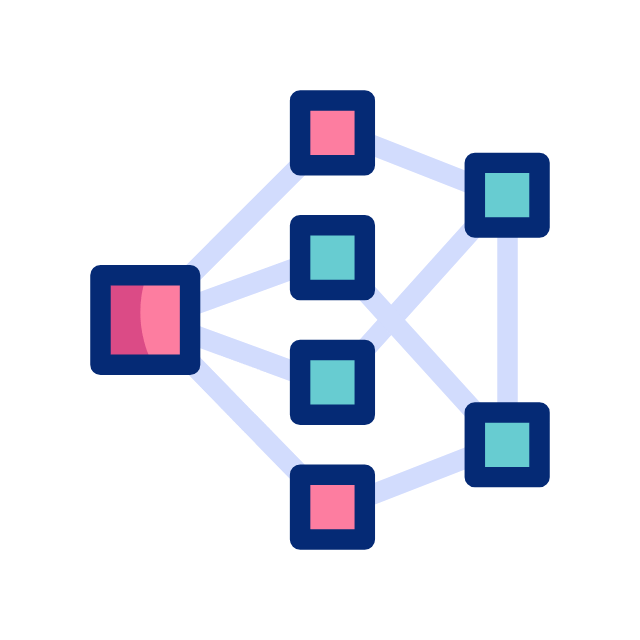

<p align="center">
  
</p>

# Forge-AI — Enterprise AI Workflow Platform

> From business problem to production-ready AI — in days, not months.

Forge-AI is an end-to-end agentic platform that turns an enterprise business problem into a deployed, monitored AI solution. A strategist describes the problem in plain English; the platform handles research, strategy, experimentation, and deployment automatically.

---

## Why Forge-AI

Enterprise data science teams spend most of their time *before* and *after* modelling — scoping problems, sourcing data, picking architectures, and wiring up deployment infrastructure. Forge-AI automates that scaffolding so teams reach a validated baseline in days, not months.

| Without Forge-AI | With Forge-AI |
|---|---|
| Weeks of problem scoping | Minutes via conversational intake |
| Manual market research | Automated Exa-powered industry benchmarks |
| Hand-rolled experiment loops | AI Experiment Runner with leaderboard |
| Bespoke deployment scripts | Artifact Forge — containerised, versioned |
| No baseline until month 3 | Sandboxed baseline within days |

**Supported industry domains:** e-commerce, telecom, fintech, logistics, healthcare, retail — any domain where a tabular, text, image, or document dataset exists.

---

## How It Works — End-to-End Flow

```
Business Problem (natural language)
        │
        ▼
┌────────────────────────────────────┐
│  1. CONVERSATIONAL INTAKE          │   Plain-English problem description
│     Ask clarifying questions       │   Domain, scale, constraints
└──────────────┬─────────────────────┘
               │
               ▼
┌────────────────────────────────────┐
│  2. DISCOVERY (Exa Agent)          │   Market research & revenue impact
│     Industry benchmarks            │   AI/ML ROI data from live web
│     Competitor adoption rates      │   Narrows the problem search space
└──────────────┬─────────────────────┘
               │
               ▼
┌────────────────────────────────────┐
│  3. STRATEGY AGENT                 │   Dual-lens decomposition
│     Business lens + DS lens        │   Business KPIs mapped to ML tasks
│     Constraint audit               │   Routes to Traditional ML or GenAI
│     1–4 scoped ML sub-problems     │
└──────────────┬─────────────────────┘
               │
               ▼
┌────────────────────────────────────┐
│  4. DATASET SOURCING               │   Upload CSV / Parquet / PDF
│     Exa public dataset discovery   │   Or discover from Kaggle / public repos
│     Schema inference + confirmation│   Column mapping per ML task type
└──────────────┬─────────────────────┘
               │
               ▼
┌────────────────────────────────────┐
│  5. MODEL BUILDER                  │   AI Experiment Runner
│     Runs sandboxed experiments     │   Multiple architectures in parallel
│     Leaderboard ranks results      │   Best baseline auto-selected
│     Metric-aligned evaluation      │   Reduces weeks of DS work to hours
└──────────────┬─────────────────────┘
               │
               ▼
┌────────────────────────────────────┐
│  6. ARTIFACT FORGE                 │   Packages the winning model
│     Generates inference API        │   Docker container + serving code
│     Deployment architecture        │   Local / cloud / serverless targets
│     Monitoring & metrics config    │
└──────────────┬─────────────────────┘
               │
               ▼
        Production-Ready AI Solution
```

---

## Architecture Layers

### Agentic Layer — Conversational Service

The front door of the platform. Powered by LangGraph with stateful interrupt/resume flows.

| Agent | Role |
|---|---|
| **Intake Agent** | Extracts business problem, domain, scale, and constraints from free text |
| **Discovery Agent** | Uses Exa to pull real-world revenue impact stats, AI ROI benchmarks, and industry adoption rates |
| **Strategy Agent** | Applies dual-lens scoping (business + data science), audits constraints, routes to ML task types |
| **Dataset Agent** | Guides dataset upload or Exa-powered public dataset discovery; infers and confirms column mappings |
| **Output Compiler** | Assembles a validated structured payload consumed by the Model Builder |

### Model Builder Layer

Orchestrates AI experiments across both traditional ML and GenAI workloads.

| Component | Role |
|---|---|
| **Orchestrator** | Routes each ML sub-problem to the correct experiment designer |
| **AI Experiment Runner (Traditional ML)** | Tabular, text, image, multimodal — classification, regression, forecasting |
| **AI Experiment Runner (GenAI)** | RAG pipeline optimisation for QA and document retrieval |
| **Experiment Leaderboard** | Ranks all runs by business-aligned metrics; surfaces the best baseline |

### Artifact Forge Layer

Packages the best experiment into a deployable, production-grade artifact.

| Component | Role |
|---|---|
| **Artifact Resolver** | Selects the winning model artifact from the leaderboard |
| **API Generator** | Wraps the model in a typed inference API |
| **Sandbox Runner** | Verifies the artifact in an isolated environment before promotion |
| **Deployment Resolver** | Emits Docker / cloud / serverless deployment configs |

---

## Supported Problem Types

### Traditional ML
- Binary & multiclass classification
- Regression
- Time-series forecasting
- Text classification
- Image classification
- Named entity recognition

### GenAI / RAG
- Document question answering
- Document retrieval & semantic search

---

## Repository Layout

```text
VectorForgeV1/
├── frontend/                          # Next.js web application
│   ├── app/
│   │   ├── dashboard/                 # Workspace dashboard
│   │   ├── run-workflow/              # Chat-driven workflow initiation
│   │   ├── generating-artifact/       # Experiment progress & leaderboard
│   │   └── api/                       # Next.js API routes
│   └── components/
│       ├── chat/                      # Conversational UI cards
│       ├── cards/                     # Discovery, strategy, dataset cards
│       ├── artifacts/                 # Artifact viewer & download
│       └── shell/                     # App shell & navigation
│
├── backend/
│   ├── app/                           # Platform API (auth, billing, workspaces)
│   │   ├── routers/                   # REST endpoints
│   │   ├── services/                  # Auth, billing, workspace logic
│   │   └── schemas/                   # Pydantic request/response models
│   │
│   ├── conversational/                # Agentic conversational service
│   │   ├── graph/
│   │   │   └── nodes/
│   │   │       ├── intake.py          # Problem extraction & clarification
│   │   │       ├── discovery.py       # Exa market research agent
│   │   │       ├── decomposer.py      # Strategy agent & ML routing
│   │   │       ├── dataset_sourcing.py# Dataset upload / discovery flow
│   │   │       └── output_compiler.py # Structured payload assembly
│   │   ├── services/
│   │   │   ├── exa_search.py          # Exa web search integration
│   │   │   ├── llm.py                 # LLM structured output calls
│   │   │   ├── redis_cache.py         # State & streaming cache
│   │   │   └── s3.py                  # Dataset storage
│   │   └── models/
│   │       ├── schemas.py             # Conversation state models
│   │       └── problem_taxonomy.yaml  # Supported ML problem type registry
│   │
│   └── modelbuilder/                  # AI Experiment Runner & Artifact Forge
│       ├── app.py                     # FastAPI entrypoint
│       └── src/vectorforge_v1/
│           ├── orchestrator/          # Cross-designer experiment orchestration
│           ├── exp_designer/
│           │   ├── trad_ml/           # Traditional ML experiment designer
│           │   └── gen_ai/            # GenAI / RAG experiment designer
│           ├── artifact_forge/        # Model packaging & deployment
│           │   ├── sandbox/           # Isolated experiment verification
│           │   ├── deploy/            # Docker & cloud deployment generators
│           │   └── generators/        # Artifact builders per engine type
│           └── utils/                 # Shared utilities
```

---

## Quick Start

### Prerequisites

- Python 3.12+
- Node.js 20+
- Redis (for conversational state)
- AWS S3 bucket (for dataset storage)

### Backend — Conversational Service

```bash
cd backend/conversational
python3.12 -m venv .venv && source .venv/bin/activate
pip install -e .
uvicorn main:app --host 0.0.0.0 --port 8001 --reload
```

### Backend — Model Builder

```bash
cd backend/modelbuilder
python3.12 -m venv .venv && source .venv/bin/activate
pip install -e ".[all]"
uvicorn app:app --host 0.0.0.0 --port 8000 --reload
```

### Frontend

```bash
cd frontend
npm install
npm run dev
```

---

## Environment Variables

```bash
# LLM
OPENAI_API_KEY=...
OPENAI_MODEL=gpt-4o-mini                    # optional, default shown
OPENAI_EMBEDDING_MODEL=text-embedding-3-small

# Discovery agent
EXA_API_KEY=...

# Dataset storage
AWS_ACCESS_KEY_ID=...
AWS_SECRET_ACCESS_KEY=...
AWS_REGION=us-east-1
S3_BUCKET_NAME=...

# Conversational state
REDIS_URL=redis://localhost:6379

# Platform API
DATABASE_URL=...
JWT_SECRET=...

# Billing (optional)
STRIPE_SECRET_KEY=...
```

---

## Industry Domain Examples

### E-Commerce — Quick Commerce

**Problem:** High cart abandonment and missed delivery SLAs eroding margins.

**Forge-AI output:**
- Conversion probability model (binary classification on session features)
- Demand forecast per SKU per zone (time-series forecasting)
- Policy Q&A over ops playbooks (RAG document retrieval)

**Impact:** 23% reduction in abandonment, 3-day baseline reached vs. 6-week manual effort.

---

### Telecom — Customer Churn

**Problem:** Churn rate of 4.2% monthly costing $18M ARR.

**Forge-AI output:**
- Churn propensity model (binary classification on usage + billing features)
- Retention offer recommendation engine (multiclass classification)
- Support knowledge base Q&A for agent-assist (RAG question answering)

**Impact:** Churn reduced 31%, experiment baseline in 2 days vs. 8 weeks.

---

## Key Design Decisions

**Exa for live discovery, not static benchmarks** — market data and ROI stats are pulled live from the web at intake time so every analysis reflects current industry state, not cached training data.

**Interrupt/resume conversation flow** — the conversational graph uses LangGraph's interrupt pattern so users can upload datasets, confirm schema mappings, and review strategy without losing state across page refreshes.

**Sandboxed experiments** — every experiment run executes in an isolated environment. The leaderboard only promotes artifacts that pass sandbox verification, preventing broken models from reaching deployment.

**Engine-agnostic orchestration** — the orchestrator routes sub-problems to whichever experiment runner fits (traditional ML or GenAI) so a single business problem can produce both a predictive model and a retrieval system from one intake conversation.

---

## License

MIT
