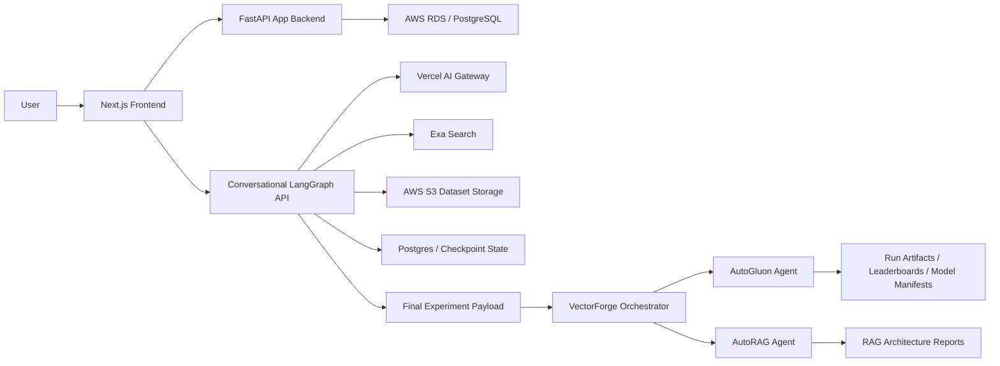

# VectorForge V1 Developer And Evaluation Guide

## Purpose

VectorForge V1, branded in the UI as Forge AI Knowledge Studio, is an agentic AI product-building studio. A user starts with a natural-language business problem, then agents turn it into scoped ML/RAG use cases, source or upload datasets, confirm schema, route work to experiment designers, train/evaluate models, and prepare deployable AI assets.

The project is designed for the hackathon theme: build anything, but make it agentic. The core product is not only a dashboard; it is a multi-stage autonomous system that reasons, asks for approvals, uses external tools, stores state, and hands structured work to downstream experiment agents.

## Repository Map

| Area | Path | Responsibility |
|---|---|---|
| Frontend app | `frontend/` | Next.js 15 dashboard, auth screens, workspace/project navigation, agent conversation UI, dataset/model registry views. |
| Main backend | `backend/app/` | FastAPI API for auth, workspace/project CRUD, DB-backed dataset/model retrieval, and demo workflow endpoints. |
| Database schema | `db/schema.sql` | PostgreSQL schema for users, sessions, workspaces, projects, use cases, Exa runs, datasets, training, RAG, deployments, approvals, and billing. |
| Conversational agent API | `backend/conversational/` | LangGraph service that turns a business problem into structured experiment-ready output. Uses Vercel AI Gateway, AWS S3, AWS RDS/Postgres checkpointing, and Exa. |
| Experiment orchestrator | `src/vectorforge_v1/orchestrator/runner.py` | Routes final conversational output to AutoGluon or AutoRAG experiment designers and materializes S3/local data. |
| Traditional ML designer | `src/vectorforge_v1/exp_designer/trad_ml/autogluon/` | LangGraph AutoGluon research loop for profiling, planning, validating, running experiments, evaluating winners, and writing reports. |
| GenAI/RAG designer | `src/vectorforge_v1/exp_designer/gen_ai/autorag/` | Agentic AutoRAG experiment designer for RAG architecture search and evaluation. |

## Product Flow

1. User logs in or signs up through the Next.js frontend.
2. Backend creates or validates `app_users`, `auth_sessions`, identities, and workspace memberships in Postgres.
3. User selects or creates a workspace and project.
4. The dashboard can show workspace, project, dataset, and model records scoped to the logged-in user and selected workspace.
5. The agent chat flow explains the AI product journey: strategy, data sourcing, Exa dataset build, schema confirmation, model training, AutoRAG, deployment, and billing approval.
6. The separate conversational LangGraph API can run the real agent planning flow:
   - `Intent Agent` extracts business context and asks clarifying questions.
   - `Strategy Agent` decomposes the problem into ML sub-problems and routes each to AutoGluon or AutoRAG.
   - `Dataset Agent` asks the user to upload, discover, or skip data for each sub-problem.
   - `Output Compiler` creates a final structured payload for downstream experiments.
7. The orchestrator consumes that final payload, downloads or copies datasets, writes mapping artifacts, and routes each problem to AutoGluon or AutoRAG.
8. AutoGluon runs a second LangGraph loop that profiles data, plans metrics and experiments, validates plans, asks for confirmation, executes rounds, ranks results, and writes final recommendations.

## Architecture



## Frontend Details

The frontend is a Next.js 15 app under `frontend/`.

Key files:

| File | Role |
|---|---|
| `frontend/app/page.tsx` | Homepage and product positioning. |
| `frontend/app/login/page.tsx` / `frontend/app/signup/page.tsx` | Auth screens. |
| `frontend/app/dashboard/page.tsx` | Main dashboard shell; switches between chat, workspaces, projects, datasets, and models. |
| `frontend/components/shell/top-bar.tsx` | Top navigation, selected workspace/project breadcrumb, user menu, theme controls. |
| `frontend/components/shell/sidebar.tsx` | Compact icon navigation. |
| `frontend/components/chat/chat-thread.tsx` | Guided agentic product conversation. |
| `frontend/components/chat/workspace-details.tsx` | Workspace registry and create workspace flow. |
| `frontend/components/chat/project-details.tsx` | Project registry and create project flow. |
| `frontend/components/chat/dataset-details.tsx` | DB-backed dataset view with S3 path, CSV/PDF format, structured/unstructured category, target/task metadata. |
| `frontend/components/chat/model-details.tsx` | DB-backed model/training/leaderboard view. |
| `frontend/lib/api.ts` | Browser API client, auth persistence, workspace/project/dataset/model fetch helpers. |
| `frontend/app/globals.css` | Theme tokens, light/dark mode, app surface styling. |

Current frontend behavior:

- Auth token and user profile are stored in local storage.
- Workspace/project creation calls authenticated backend APIs.
- Workspace/project/dataset/model views are scoped to selected workspace and logged-in user.
- The chat view currently renders the guided demo workflow and uses DB-backed project assets when selected.
- The design uses the attached color palette through CSS tokens and supports light/dark mode.

## Backend Details

The main backend is a FastAPI service under `backend/app/`.

Key modules:

| Module | Role |
|---|---|
| `backend/app/main.py` | FastAPI app factory, CORS, router registration. |
| `backend/app/routers/auth.py` | Signup, login, Google mock auth, logout. |
| `backend/app/routers/workspaces.py` | Workspace, project, dataset, model, and project asset endpoints. |
| `backend/app/routers/workflow.py` | Demo workflow endpoints for strategy, Exa run mock, schema confirmation, training, deployment, billing. |
| `backend/app/services/auth_service.py` | Password hashing, session creation, identity linking, workspace bootstrap. |
| `backend/app/services/workspace_service.py` | Workspace/project persistence and DB-backed dataset/model queries. |
| `backend/app/db/connection.py` | PostgreSQL connection helper. |
| `backend/app/schemas/*.py` | Pydantic request/response contracts. |

Important API endpoints:

| Endpoint | Purpose |
|---|---|
| `POST /api/auth/signup` | Create user and password identity. |
| `POST /api/auth/login` | Validate password and create session token. |
| `POST /api/auth/google` | Mock Google identity flow. |
| `POST /api/auth/logout` | Revoke session token. |
| `GET /api/workspaces` | List workspaces visible to authenticated user. |
| `POST /api/workspaces` | Create workspace and owner membership. |
| `GET /api/projects?workspaceId=...` | List projects in a workspace after membership check. |
| `POST /api/projects` | Create project in selected workspace for authenticated user. |
| `GET /api/datasets?workspaceId=...&projectId=...` | List datasets with S3 path and format/category metadata. |
| `GET /api/models?workspaceId=...&projectId=...` | List model training and leaderboard details. |
| `GET /api/workspaces/{workspace_id}/projects/{project_id}/assets` | Return project assets for the chat view. |

Security and tenancy:

- Every workspace/project/dataset/model read path checks workspace membership.
- Projects are inserted with `created_by` and `organization_id`.
- Passwords use PBKDF2-HMAC-SHA256 with per-user salt and 260,000 iterations.
- Sessions are stored in `auth_sessions` and can be revoked.

## Database Model

`db/schema.sql` defines a Postgres model for the full AI product lifecycle.

Core tables:

| Table | Purpose |
|---|---|
| `app_users`, `auth_identities`, `user_password_credentials`, `auth_sessions` | Authentication and identity. |
| `organizations`, `workspace_members` | Workspace tenancy and roles. |
| `projects`, `use_cases` | Product hierarchy. |
| `chat_threads`, `chat_messages` | Conversation history and agent messages. |
| `attachments` | Uploaded file metadata. |
| `data_source_runs`, `exa_runs`, `exa_run_events` | Dataset sourcing and Exa run traceability. |
| `datasets`, `dataset_columns`, `dataset_records` | Structured/unstructured datasets, schema, records, S3 paths. |
| `provenance_sources`, `dataset_field_provenance` | Data provenance. |
| `schema_confirmations` | Human confirmation of targets and quality fixes. |
| `training_runs`, `model_leaderboard_entries`, `feature_importances` | Model training, evaluation, artifacts, and explainability. |
| `rag_runs`, `rag_pipeline_stages`, `rag_configurations` | RAG experiment tracking. |
| `deployments` | Production deployment metadata. |
| `approval_requests` | Human-in-the-loop gates for Exa, schema, training, deployment, billing. |
| `billing_accounts` | Stripe-ready billing metadata. |

Recent schema support added for live registry views:

- `datasets.project_id`
- `datasets.s3_path`
- `datasets.data_format`
- `datasets.data_category`
- `training_runs.project_id`
- `training_runs.model_artifact_s3_path`
- `model_leaderboard_entries.artifact_s3_path`

## Conversational Agent API

The conversational API under `backend/conversational/` is the strongest agentic core of the project.

Main files:

| File | Role |
|---|---|
| `backend/conversational/graph/graph.py` | LangGraph assembly and routing. |
| `backend/conversational/graph/state.py` | Durable conversation state schema. |
| `backend/conversational/graph/nodes/intake.py` | Intent Agent. |
| `backend/conversational/graph/nodes/decomposer.py` | Strategy Agent. |
| `backend/conversational/graph/nodes/dataset_sourcing.py` | Dataset Agent. |
| `backend/conversational/graph/nodes/output_compiler.py` | Final plan compiler. |
| `backend/conversational/api/routes.py` | Start, resume, upload, inspect, and final-output endpoints. |
| `backend/conversational/services/llm.py` | Vercel AI Gateway OpenAI-compatible client. |
| `backend/conversational/services/exa_search.py` | Exa dataset discovery. |
| `backend/conversational/services/s3.py` | AWS S3 upload and presigned URL helpers. |
| `backend/conversational/graph/checkpointer.py` | Graph checkpoint storage. |

Agent flow:

1. `intake_node`
   - Reads full conversation history.
   - Uses structured LLM tool calling to extract business problem, domain, scale, and constraints.
   - Asks up to three clarification rounds.
   - Moves to decomposition once context is sufficient or clarification budget is exhausted.
2. `decomposer_node`
   - Loads `problem_taxonomy.yaml`.
   - Applies constraint audit, dual-lens scoping, and ML routing.
   - Chooses `traditional/autogluon` or `genai/autorag`.
   - Infers label, target, timestamp, document, or QA columns.
   - Interrupts for user confirmation.
3. `dataset_sourcing_node`
   - Loops once per ML sub-problem.
   - Lets user choose upload, Exa discovery, or skip.
   - Upload path stores files in AWS S3.
   - Discovery path searches public dataset sources through Exa.
   - Schema phase asks user to confirm or override inferred columns.
4. `output_compiler_node`
   - Merges ML sub-problems and dataset sources.
   - Builds a final payload with `ml_problems`, `max_experiment_per_round`, and `num_round`.
   - Interrupts for final review.
   - Produces `ready_for_experiments=true` output.

Conversation endpoints:

| Endpoint | Purpose |
|---|---|
| `POST /api/v1/conversations` | Start graph run and return first interrupt. |
| `GET /api/v1/conversations/{session_id}` | Inspect current state and pending interrupt. |
| `POST /api/v1/conversations/{session_id}/respond` | Resume graph with user response. |
| `POST /api/v1/conversations/{session_id}/upload-dataset` | Upload dataset to S3 and resume graph. |
| `GET /api/v1/conversations/{session_id}/final-output` | Fetch final orchestrator payload. |

## Orchestrator And Experiment Designers

The orchestrator in `src/vectorforge_v1/orchestrator/runner.py` consumes the final conversational output and routes each problem.

Routing rules:

| Problem category/engine | Designer |
|---|---|
| `traditional` + `autogluon` | `src/vectorforge_v1/exp_designer/trad_ml/autogluon/` |
| `genai` + `autorag` | `src/vectorforge_v1/exp_designer/gen_ai/autorag/` |

What the orchestrator writes:

- Original request: `input/business_request.json`
- Per-problem planner input: `problems/{problem_id}/planning/round_1_planner_input.json`
- Field mapping: `problems/{problem_id}/planning/field_mapping.json`
- Target resolution: `problems/{problem_id}/planning/target_column_resolution.json`
- Designer outputs under `designers/trad_ml/autogluon/` or `designers/gen_ai/autorag/`
- Summary: `reports/orchestrator_summary.json`

AutoGluon designer graph:

| Node | Responsibility |
|---|---|
| `clarify_user_request` | Validate required dataset/problem fields. |
| `create_run_artifacts` | Create run directories and status files. |
| `profile_dataset` | Profile input CSV. |
| `plan_initial_metric_decision` | Choose task type and primary/secondary metrics. |
| `validate_initial_decision` | Validate task and metric against supported choices. |
| `await_user_confirmation` | Human confirmation before running experiments. |
| `initialize_round` | Start optimization round. |
| `plan_round_experiments` | Generate experiment configs. |
| `validate_round_plan` | Check allowed intents/config fields/time limits. |
| `dispatch_experiments` / `run_experiment` | Fan out model experiments. |
| `collect_round_results` | Detect successful runs. |
| `select_round_winner` | Pick best model and write manifest. |
| `summarize_round` | Append research log and leaderboard. |
| `should_continue_rounds` | Stop/continue round loop. |
| `select_final_winner` / `write_final_recommendation` | Produce final recommendation. |
| `mark_failed` | Write failed status on invalid state or errors. |

## Hackathon Stack Coverage

### AWS

Implemented or represented:

- AWS RDS/PostgreSQL is used by the main backend for application state.
- AWS RDS/PostgreSQL is supported by the conversational API for LangGraph checkpointing.
- AWS S3 stores uploaded datasets through `backend/conversational/services/s3.py`.
- The DB schema tracks S3 paths for datasets and model artifacts.
- The schema contains `sagemaker_job_arn` and model artifact fields for managed ML training/deployment tracking.

Top 5 requirement note:

- Judges require direct AWS infrastructure deployments using the provisioned AWS sandbox account. The code is ready to use RDS and S3, but final submission should show the running backend/agent service deployed on AWS compute, with RDS/S3 resources visible in the sandbox account.

### Vercel

Implemented:

- Next.js frontend is Vercel-compatible.
- Conversational agent calls LLMs through Vercel AI Gateway in `backend/conversational/services/llm.py`.

Top 5 requirement note:

- The project integrates Vercel AI Gateway, satisfying the required Vercel product category if deployed/configured with the hackathon Vercel account.

### Exa

Implemented:

- Dataset discovery uses Exa neural search in `backend/conversational/services/exa_search.py`.
- The Dataset Agent can choose the discovery path, generate a dataset-oriented query, show Exa results, and let the user pick one.
- The database schema includes `exa_runs`, `exa_run_events`, structured outputs, grounding, cost, and error fields for traceability.

Best use of Exa opportunity:

- The strongest demo path should show Exa being used by the agent to find a dataset or evidence source based on inferred problem requirements, not as a simple manual search box.

### Stripe

Implemented or represented:

- Schema includes `stripe_customer_id` on organizations and billing accounts.
- `billing_accounts` and `approval_requests` model plan, subscription, billing approval, and cost estimates.
- Frontend includes `BillingApprovalCard`.
- Backend has `POST /api/billing/approve` demo endpoint.

Best use of Stripe gap:

- There is no live Stripe API integration yet in the current code. To compete for Best use of Stripe, add real Checkout/Billing Portal/subscription or usage-metering calls and store returned customer/subscription IDs in Postgres.

## Judging Criteria Mapping

### Agent Overview

Agents built:

| Agent | Code | Purpose |
|---|---|---|
| Intent Agent | `backend/conversational/graph/nodes/intake.py` | Converts natural-language business problem into structured context. |
| Strategy Agent | `backend/conversational/graph/nodes/decomposer.py` | Decomposes problem into feasible ML/RAG sub-problems and routes engines. |
| Dataset Agent | `backend/conversational/graph/nodes/dataset_sourcing.py` | Chooses dataset sourcing path, uploads to S3, searches Exa, confirms schema. |
| Output Compiler | `backend/conversational/graph/nodes/output_compiler.py` | Creates experiment-ready structured payload. |
| AutoGluon Research Agent | `src/vectorforge_v1/exp_designer/trad_ml/autogluon/workflow/` | Profiles data, plans model search, runs/evaluates experiments, recommends model. |
| AutoRAG Agent | `src/vectorforge_v1/exp_designer/gen_ai/autorag/` | Designs and evaluates RAG architectures. |

### Autonomy And Decision-Making

The system demonstrates autonomy through:

- Structured LLM extraction of problem context.
- Bounded clarification loop with a maximum of three rounds.
- Taxonomy-based task routing to AutoGluon or AutoRAG.
- Constraint audit that can drop infeasible problems.
- Dual-lens scoping that checks business actionability and data science feasibility.
- Automatic inferred column mapping by task type.
- Dataset query generation for Exa search.
- AutoGluon metric selection and experiment planning.
- Round-based model search with validation, leaderboard creation, and final winner selection.

Decision safeguards:

- Problem routing is constrained by `problem_taxonomy.yaml`.
- AutoGluon metrics are validated against `SUPPORTED_METRICS`.
- Experiment intents/config fields/time limits are validated before execution.
- Human confirmation gates exist before sub-problem acceptance, schema lock, and final output.

### Actions And Tool Use

Tools/APIs/environments used:

| Tool | Action |
|---|---|
| Vercel AI Gateway | Structured LLM calls for intent extraction and strategy decomposition. |
| Exa | Live public dataset discovery. |
| AWS S3 | Dataset upload and storage. |
| AWS RDS/Postgres | Auth, tenancy, workspace/project/dataset/model state, and optional graph checkpointing. |
| AutoGluon | Traditional ML model search. |
| AutoRAG | RAG pipeline search and evaluation. |
| FastAPI | Backend API surface for frontend and graph sessions. |
| Next.js | User-facing application. |

Real-world actions:

- Create users, sessions, workspaces, and projects in DB.
- Upload dataset files to S3.
- Search live web dataset sources through Exa.
- Materialize datasets from S3/local paths for experiments.
- Run model experiments and write artifacts/recommendations.
- Prepare deployment/billing approval records.

### Orchestration

There are two orchestration layers:

1. Conversational LangGraph:
   - Routes from intake to decomposer to dataset sourcing to output compiler.
   - Uses state status to decide the next node.
   - Uses interrupts to pause for user input and resume exactly where needed.

2. Experiment orchestrator:
   - Reads final payload.
   - Splits into independent ML sub-problems.
   - Routes each to AutoGluon or AutoRAG.
   - Writes field mappings so each designer input is traceable to the original business request.

AutoGluon has a third internal orchestration loop:

- Profile -> plan -> validate -> confirm -> round planning -> experiment fan-out -> collect -> evaluate -> repeat/finalize/fail.

### Human-In-The-Loop

Human intervention points:

- Clarifying questions during intake.
- Confirm or adjust identified ML sub-problems.
- Choose dataset source: upload, discover, or skip.
- Upload actual dataset file.
- Select Exa result or custom URL.
- Confirm or override inferred schema/columns.
- Final review of experiment-ready output.
- AutoGluon confirmation before training.
- Demo UI includes schema, deployment, and billing approval cards.

These HITL gates are important for enterprise readiness because they keep agents autonomous while preserving control over cost, schema correctness, deployment, and billing.

### Failure Handling

Implemented:

- Conversational API returns `503` when graph is not ready.
- Conversation routes return `404` for missing sessions and `409` when final output is requested too early.
- S3 upload exceptions become `502 S3 upload failed`.
- Dataset discovery catches Exa errors and returns an empty results list so the graph can continue.
- Intake has a clarification round cap and proceeds with assumptions if the user does not provide full context.
- AutoGluon validates task/metric/round plans and routes invalid states to `mark_failed`.
- AutoGluon active runs can be marked failed through API.
- Backend DB errors are converted into `503 Database error`.
- Frontend logout clears local session even if backend logout fails.

Recommended improvements before final judging:

- Add explicit retry/backoff around Exa and Vercel AI Gateway calls.
- Persist conversational final output into the main application database.
- Surface backend and graph errors in the dashboard instead of relying mostly on demo cards.
- Add audit log rows for every approval/override.

### Demo And Presentation

Recommended demo sequence:

1. Open deployed Vercel frontend.
2. Log in and show authenticated user menu.
3. Create/select a workspace and project.
4. Start with a business problem such as enterprise churn or support deflection.
5. Show the Intent Agent asking clarifying questions.
6. Show the Strategy Agent decomposing into AutoGluon and/or AutoRAG tasks.
7. Choose Exa discovery for one dataset and upload/S3 for another.
8. Confirm schema and final output.
9. Run or show orchestrator artifacts: field mapping, planner input, leaderboard, final recommendation.
10. Show DB-backed dataset/model registry in the dashboard.
11. End with deployment/billing approval story and explain what AWS/Vercel/Exa infrastructure is live.

## Production Readiness Checklist

Required before public demo:

- Remove hardcoded AWS credential defaults from `src/vectorforge_v1/orchestrator/runner.py`; use only environment variables or AWS roles.
- Confirm `.gitignore` excludes `.env`, `.next`, `node_modules`, run artifacts, model artifacts, and uploaded datasets.
- Deploy frontend to Vercel.
- Deploy backend/conversational agent on AWS compute and connect to sandbox RDS/S3.
- Configure Vercel AI Gateway key in environment.
- Configure Exa key in environment.
- Run `db/init_db.py` against the AWS RDS instance.
- Add seed/demo records for datasets, training runs, model leaderboard entries, and RAG runs if the live experiment will not finish inside demo time.
- Add a real Stripe Checkout or Billing Portal flow if competing for the Stripe prize.

Recommended engineering improvements:

- Add automated tests for auth, workspace access control, project creation, dataset/model endpoints, and conversational graph interrupts.
- Replace mock Google auth with verified Google Identity Services or OAuth.
- Wire the Next.js chat UI directly to `backend/conversational` endpoints.
- Persist conversational sessions/messages into `chat_threads` and `chat_messages`.
- Persist Exa results and selected provenance into `exa_runs` and provenance tables.
- Persist orchestrator training outputs into `training_runs`, `model_leaderboard_entries`, `rag_runs`, and `deployments`.
- Add observability: request IDs, structured logs, graph state transitions, agent costs, token usage, and run durations.

## Local Development

Frontend:

```bash
cd frontend
npm install
npm run dev
```

Main backend:

```bash
cd backend
uv venv
uv sync
uv run uvicorn main:app --host 127.0.0.1 --port 8000
```

Initialize DB:

```bash
cd db
uv run --project ../backend python init_db.py
```

Conversational agent API:

```bash
cd backend/conversational
uv venv
uv sync
uv run uvicorn conversational.main:app --reload --port 8000
```

Traditional ML designer:

```bash
VECTORFORGE_EXPERIMENT_MODE=mock \
uv run uvicorn vectorforge_v1.exp_designer.trad_ml.autogluon.main:app --reload
```

Orchestrator plan-only:

```bash
vectorforge-v1-orchestrate examples/telecom_churn_orchestrator_request.json --work-dir runs --plan-only
```

## Known Gaps And Risks

- Frontend chat is still largely demo-scripted and should be wired to the conversational agent API for the strongest submission.
- `backend/app/routers/workflow.py` contains several mock/demo endpoints.
- Live Stripe integration is not implemented yet.
- AWS SageMaker deployment/training fields exist in DB, but the current code does not launch SageMaker jobs.
- The project has multiple backend entry points; final deployment should clearly choose which service runs where.
- The conversational API README uses `S3_BUCKET_NAME` language, while config reads `AWS_BUCKET`; align env names before deployment.
- Remove any credentials from source before pushing or presenting.

